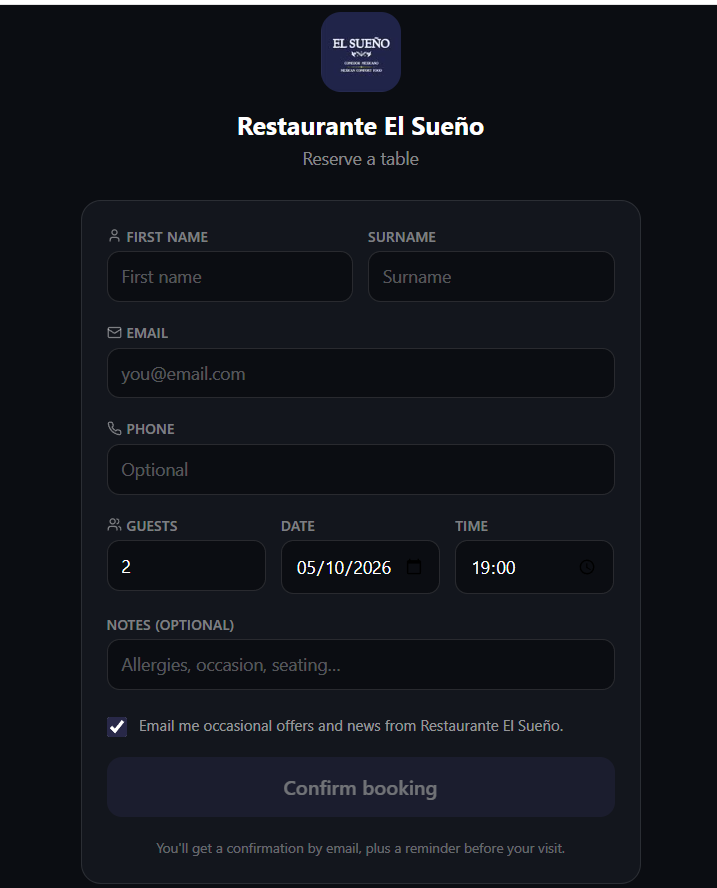

# Bug report 004 - Marketing opt-in is pre-ticked on the reservation form

**App** lightmenu.app
**Date** 05/10/2026
**Severity** Moderate
**Status** Open

## Summary
The news letter offers and mareting button in the reservation links is pre clicked. this is both technical and legal problem because sometimes a clients wouldn't want to have it ticked. having it pre ticket make it seem madatory.

## Steps to reproduce
1. Open a private window.
2. Go to https://www.lightmenu.app/reservation/restaurannt-name
3. Look at the checkbox above "Confirm booking".

## Expected
The button to be unticked and to have another tick button which is terms and conditions. 
## Actual
This defect is present in every reservation link.

## Impact
Lightmenu and the user are both effected which could lead to a legal problem that may not meet with the EU consent rules  (GDPR, Rectical 32).

## Evidence
